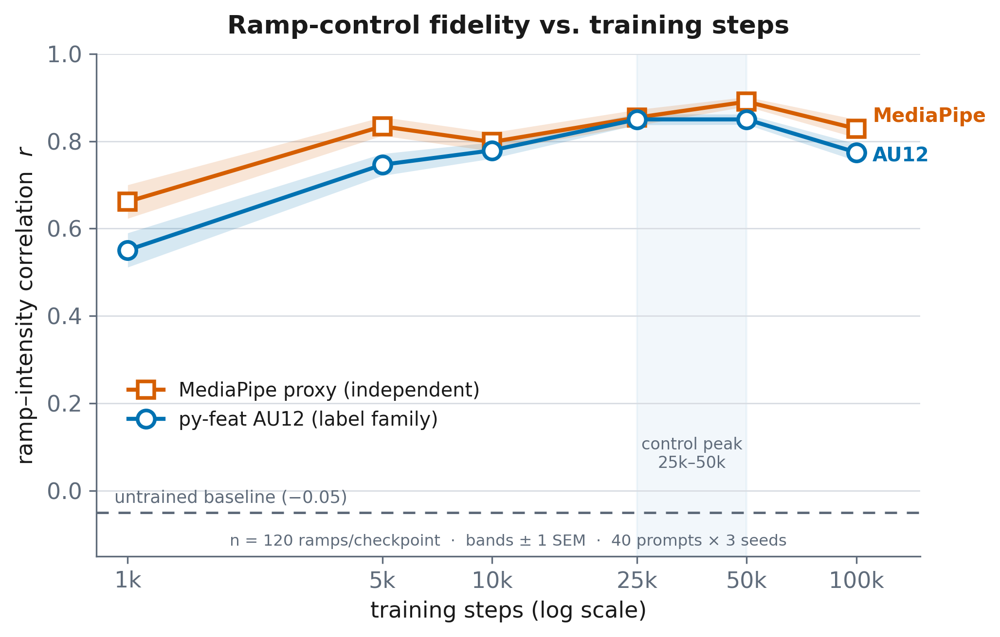

# 2026-08-11 — Training-step dose–response (r vs. training steps)

Tier 3 (supporting evidence) from the Evaluation Robustness checklist: does training
*drive* the ramp-control capability, and how does it evolve over training? Evaluated the
ascending-ramp `scaled` protocol at six checkpoints spanning the single continuous
1k→100k training trajectory.

## Setup

- **Checkpoints (one continuous run):** 1k / 5k / 10k from `expression-2026-05-21T22-07-08`,
  25k / 50k / 100k from `expression-2026-05-26T21-43-56`. Verified these are **one
  trajectory**: the 05-26 run is an explicit resume-from-step-23000 of the 05-21 run under
  the same `configs/train_genphoto/expression.yaml` (see run-history table in
  [2026-05-26-training-run-100k](2026-05-26-training-run-100k.md)); the blocker-fix
  *validation* was a separate run in `output/expression_validation/`, not in this lineage.
- **Protocol (identical across all six points; only the checkpoint varies):**
  `scripts/batch_eval.py --experiment scaled`, ascending ramp `[0, .25, .5, .75, 1]`,
  40 prompts (`configs/eval_prompts.txt`) × seeds 42/43/44 = **120 ramps/checkpoint**.
  Scored with py-feat AU12 (label family), MediaPipe mouth-corner proxy (label-independent),
  and facenet-VGGFace2 frame-to-frame identity.
- **Comparability control:** the 100k point was first *reused* from the 2026-07-14 eval
  (same protocol) and then **regenerated in-session**. The regen reproduced the July
  numbers to 4 decimals (au12 0.7744±0.2116 both times), confirming seed-determinism and
  that the reused point — and the 100k dip below — are real, not cross-run artifacts.
- Ran on two idle GPUs (4, 5), generate+score per checkpoint, resumable. Scratch configs +
  logs under `inference_output/batch_eval/dose_response/` (gitignored). Assembly:
  `dose_response/assemble.py`.

## Results

| step | n | AU12 r ↑ | MediaPipe r ↑ | AU12 MSE ↓ | id mean-adj ↑ | id min-adj ↑ |
|---|---|---|---|---|---|---|
| 1,000   | 120 | 0.551 ± 0.429 | 0.662 ± 0.421 | 0.216 ± 0.088 | 0.959 ± 0.023 | 0.937 ± 0.041 |
| 5,000   | 120 | 0.746 ± 0.274 | 0.834 ± 0.233 | 0.150 ± 0.088 | 0.954 ± 0.022 | 0.931 ± 0.036 |
| 10,000  | 120 | 0.779 ± 0.205 | 0.798 ± 0.232 | 0.132 ± 0.086 | 0.939 ± 0.032 | 0.906 ± 0.049 |
| 25,000  | 120 | 0.850 ± 0.138 | 0.854 ± 0.197 | **0.083 ± 0.072** | 0.937 ± 0.029 | 0.908 ± 0.045 |
| 50,000  | 120 | **0.850 ± 0.128** | **0.890 ± 0.118** | 0.094 ± 0.068 | 0.927 ± 0.036 | 0.889 ± 0.066 |
| 100,000 | 120 | 0.774 ± 0.212 | 0.829 ± 0.230 | 0.142 ± 0.092 | 0.919 ± 0.053 | 0.877 ± 0.086 |

Baseline (untrained frozen backbone, from status.md scaled eval): AU12 r = **−0.05 ± 0.64**.

Trend statistics over the six checkpoints:
- Spearman(step, AU12 r) = **+0.60**; Spearman(step, MediaPipe r) = **+0.54** (both detectors agree).
- Spearman(step, AU12 r **std**) = **−0.66** — variance shrinks as training proceeds.

## Figure

Paper-ready vector + raster at `docs/experiments/figures/2026-08-11-dose-response.{pdf,png}`
(regenerate: `inference_output/batch_eval/dose_response/plot.py`). AU12 (py-feat) and the
independent MediaPipe proxy vs. training steps (log x), ±1 SEM bands, untrained baseline
(−0.05) dashed; Okabe–Ito CVD-safe hues with redundant marker shapes.

## Findings

1. **Training drives the capability (the point of the experiment).** From an untrained
   baseline of r ≈ −0.05, ramp control is already at **0.551 by 1k steps** and rises to a
   plateau of ~0.85. This is independent evidence that the ramp-following is *learned by the
   adaptor*, not an artifact of the frozen SD prior — pre-empting the "maybe it's just SD"
   objection.
2. **Acquired early, saturates by ~25k.** Most of the gain is in the first 5k steps
   (0.55 → 0.75); the mean plateaus at 0.85 by 25k. The MediaPipe curve agrees, so the rise
   is not a py-feat circularity artifact.
3. **Reliability keeps improving after the mean saturates.** Per-prompt std falls
   monotonically 0.43 → 0.13 (through 50k): later training makes control *more consistent
   across prompts*, even where average strength has plateaued.
4. **Peak control is at 25k–50k, and 100k is mildly past-peak.** 50k → 100k regresses on
   every control metric: AU12 r 0.850 → 0.774, AU12 MSE 0.094 → 0.142, MediaPipe 0.890 →
   0.829. The 50k-vs-100k AU12 gap is statistically real (Welch t ≈ 3.4, n=120 each), and
   corroborated by the independent MediaPipe detector and by the in-session determinism
   check. **The released 100k checkpoint is not the best for ramp-following** — 25k (best
   MSE) to 50k (best both r's) is the control-quality sweet spot.
5. **Mild expression↔identity trade-off along training.** Frame-to-frame identity declines
   monotonically (mean-adj 0.959 → 0.919; min-adj 0.937 → 0.877) as expression control
   strengthens — expected, since stronger per-frame expression change means larger
   inter-frame pixel change. Identity stays high (~0.92) throughout.
6. **Supports the "no absolute calibration" diagnosis.** Ramp control saturates by 25k and
   extended training to 100k did **not** improve it (in fact slightly hurt) — consistent
   with the calibration deficit (constant-list CLS = 0.07) being a *data/formulation* limit
   of ramp-only MEAD training, not undertraining. More steps will not fix calibration.

## Caveats

- Six checkpoints (log-spaced-ish); the exact peak between 25k and 50k is not resolved.
- The py-feat/py-feat label↔eval circularity applies as everywhere in this repo; mitigated
  here by the MediaPipe curve tracking the same trend.
- 1k has high variance (std 0.43): at 1k the control works well on some prompts and not
  others — the "emergence" is prompt-dependent before it generalizes.

## Housekeeping implication

The ⚠️ constraint in `CLAUDE.md` / status.md ("do not delete intermediate checkpoints until
the dose–response has run") is now **satisfied** — deletion is unblocked. Recommendation:
if keeping one mid-run fallback, keep **25k or 50k** (the control-quality peak), not an
arbitrary midpoint; keep 100k as the nominal "final" but note it is mildly past-peak on
ramp-following. Raw scored results under `inference_output/batch_eval/dose_response/step_*/`
are the reproducible record if checkpoints are later removed.
